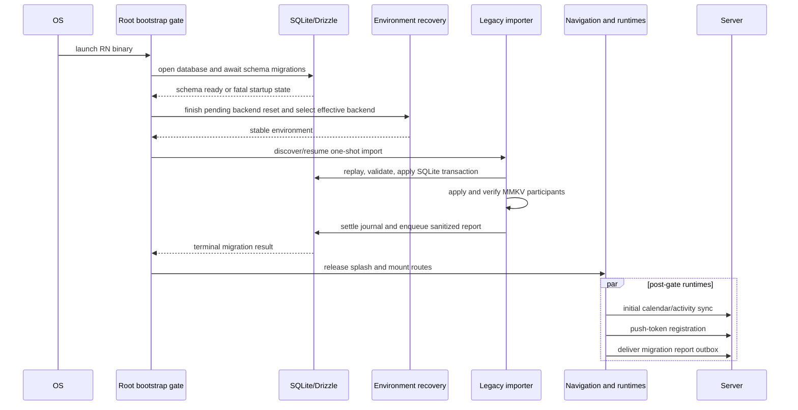

# Flutter-to-React-Native on-device data migration

**Status:** delivery specification

**Roadmap:** [Phase 09 — On-device data migration](../01-roadmap/09-data-migration.md)

**Acceptance suite:** [Flutter → React Native in-place upgrade QA](../04-migration-qa/README.md)

**Research record:** [On-device data persistence and migration](../00-exploration/data-persistence-migration.md)

## 1. Purpose

The first React Native binary must recover locally owned data when it replaces the released
Flutter binary in place. There is no server copy of personal events, checklist items, hidden
events, or calendar access tokens. Losing any of them is irreversible.

This document is the implementation contract for that one-shot importer. Current source code and
signed-device evidence take precedence over earlier roadmap assumptions.

### Goals

- Preserve the approved legacy data and preference allowlist without overwriting newer React
  Native state.
- Work offline and before onboarding, tabs, changelog, sync, or push-registration consumers mount.
- Survive a process kill at every boundary and produce the same final state after retry.
- Recover valid siblings from a partly malformed source and report every omission without
  exposing private content.
- Retain the Flutter source indefinitely as a recovery and downgrade safety net.
- Prove the real store-signed Flutter-to-React-Native update path on both platforms.

### Non-goals

- Importing server-owned timetable or activity caches.
- A reverse React-Native-to-Flutter bridge. A downgrade can lose RN-only changes.
- A user-facing migration wizard, warning, skip button, retry button, or support export.
- Converting event colours for visual parity. Valid stored colours are copied exactly as stored;
  a small dark-mode visual difference is accepted.
- Cleaning up the legacy database or preferences.
- Running the importer in a different application identity or a non-production backend.

## 2. Source contract: released Flutter app

The source application is `3.1.0+134`, with Sembast 3.8.7 and path_provider 2.1.5. It initializes
Firebase, loads
`SharedPreferences.getInstance()`, initializes Sembast, and only then mounts Flutter. Its current
database version is 3.

### 2.1 Sembast file and replay semantics

Flutter opens `simple_database.db` below `getApplicationDocumentsDirectory()`. The file is an
append-only, newline-delimited JSON log:

- the first complete JSON line is metadata, currently `{"version":3,"sembast":1}`;
- data lines contain `store`, `key`, and `value`;
- a line with `deleted: true` is a tombstone;
- the effective value for `(store, key)` is the last valid data line or tombstone encountered;
- a valid tombstone removes the effective record;
- auto-increment store keys can be JSON numbers, while application-assigned keys are strings.

The parser must replay the log in file order. It must not treat the file as one JSON document,
scan it with a regular expression, or select the first occurrence of a key.

#### Historical schema migrations

Real installs may contain records written before the current schema version. The importer applies
the following semantic migrations after replaying the log:

1. Version 2 migrated only `personal_events` records whose value contained a non-null `uid`.
   It renamed `start` to `startsAt` and `end` to `endsAt`, dropped the old fields, and supplied
   `exportedAt` from the migration time when it was absent. UID-less old records were left behind.
2. Version 3 re-keyed every `user_calendars` record whose store key differed from `value.id`: it
   wrote the value at `value.id` and tombstoned the old key.

For a version-1 personal event with a valid `uid`, the RN importer performs the version-2 mapping
and uses the journal's stable `startedAt` value when `exportedAt` is missing. It ignores an old
UID-less record as invalid and reports it. For a pre-version-3 calendar, it uses the validated
`value.id` as the logical key. These rules make retries deterministic.

Require the first complete line to be a metadata object with `sembast: 1` and an integer version.
Versions 1 through 3 are supported. Missing, non-integer, negative, or newer versions are
unsupported sources and settle as failed; no records are imported from them.

### 2.2 Effective Sembast stores

| Store | Effective key | Current value shape | Disposition |
| --- | --- | --- | --- |
| `user_calendars` | calendar `id` | `id`, `name`, `token`, optional `schoolName`/`schoolId`, `lastUpdatedAt`, `createdAt`, `visible` | Import |
| `personal_events` | event `uid` | `uid`, `title`, `color`, `startsAt`, `endsAt`, optional `location`/`description`, `exportedAt` | Import |
| `checklist_items` | item `uuid` | `uuid`, `eventUid`, `content`, `isChecked`, `order`, optional `createdAt`/`updatedAt`/`deletedAt` | Import |
| `hidden_events` | auto key | `uidHiddenEvents[]`, `namedHiddenEvents[]` | Import the final live record |
| timetable/event cache stores | implementation-defined | server responses | Do not import; re-sync |
| activity/cache stores | implementation-defined | server responses and read state | Do not import; re-sync |

Checklist deletes are normally physical store deletes, but a surviving record can also contain
`deletedAt`; preserve that field. A hidden-events write clears the store and then adds one new
record, so the final live record is authoritative. More than one live hidden-events record is
malformed: choose the last effective record, report the extras, and settle partial.

### 2.3 Flutter native preferences

The released Flutter app uses the legacy synchronous `shared_preferences` 2.5.5 API, with Android
implementation 2.4.11 and foundation implementation 2.5.4. The Android implementation calls
native `SharedPreferences` with file name `FlutterSharedPreferences`; it does not use the newer
asynchronous DataStore API. Keys have a `flutter.` prefix. On iOS they are stored in the
application's `UserDefaults` plist. The production paths still require signed-device proof.

The `flutter.` prefix is applied by the Dart API before the native call. Android therefore stores
the fully prefixed key in `shared_prefs/FlutterSharedPreferences.xml`: booleans as native boolean,
integers as long, and strings as native string. The plugin encodes doubles and string lists inside
strings with private type prefixes, but none of the imported keys uses either representation. iOS
stores the fully prefixed keys in the standard application domain as native `NSNumber`,
`NSString`, or `NSArray` values. The bridge must request the declared type for each allowlisted
key and reject a mismatched native type rather than coerce it.

The complete decision matrix is:

| Flutter key | Flutter type/default | Target meaning | Decision |
| --- | --- | --- | --- |
| `current_version` | integer / `0` | changelog seen version | Import |
| `theme` | string / `system` | RN theme | Import; see legacy fallback below |
| `dark_mode` | boolean / `false` | legacy theme fallback | Read only when `theme` is absent |
| `notification_calendar` | boolean / `true` | notifications enabled | Import |
| `startup_screen` | `home` or `calendar` / `home` | startup tab | Import |
| `show_weekends` | boolean / `true` | calendar weekend visibility | Import |
| `colors_by_group` | boolean / `false` | group-colour mode | Drop |
| `calendar_view_type` | string / `Week` | calendar view | Drop; use RN default |
| `calendar_hour_height` | number / `60` | calendar hour height | Drop; use RN default |
| `date_limit` | integer / `14` | notification horizon | Drop; use RN default of 7 days |
| `new_activity` | boolean / `false` | old activity badge | Drop; activity re-syncs |
| `last_activity_update` | number / `0` | old activity cursor | Drop; activity re-syncs |
| every other legacy key | any | none | Drop |

Theme mapping is `system → system`, `light → light`, and `dark → dark`. When `theme` is absent,
`dark_mode == true` maps to `dark`; every other valid or absent value maps to `system`. Each
preference is independent: an invalid preference is skipped, the RN default is retained, and the
run settles partial without affecting valid preferences or records.

### 2.4 Native state that is retained, not imported

Firebase installation, authentication, APNs, and FCM data live in platform-managed native
storage. They are not application-owned migration input. The importer never copies or reports
their identifiers. Push registration runs after the migration gate and obtains or refreshes the
current token normally. This also avoids restoring stale FCM credentials through Android backup;
Firebase-managed token state must follow Firebase's documented exclusion and regeneration rules.

## 3. Target contract: React Native app

### 3.1 SQLite

The target database is `timecalendar.db`, managed by Expo SQLite and Drizzle. Its current durable
tables are `user_calendars`, `personal_events`, and `checklist_items`; `calendar_events`,
`activity_logs`, and `activity_state` are server-owned/cache state and are never import targets.

Implementation adds two migration-owned tables through a normal Drizzle migration:

```text
legacy_migration_run
  id                    INTEGER PRIMARY KEY CHECK (id = 1)
  state                 TEXT NOT NULL
  report_id             TEXT NOT NULL UNIQUE
  attempt_count         INTEGER NOT NULL
  started_at            TEXT NOT NULL
  completed_at          TEXT NULL
  source_version        INTEGER NULL
  source_size_bytes     INTEGER NULL
  source_fingerprint    TEXT NULL
  sqlite_committed      INTEGER NOT NULL DEFAULT 0
  preference_progress   TEXT NOT NULL DEFAULT '{}'
  counters_json         TEXT NOT NULL DEFAULT '{}'
  error_codes_json      TEXT NOT NULL DEFAULT '[]'
  terminal_outcome      TEXT NULL

legacy_migration_report_outbox
  report_id             TEXT PRIMARY KEY
  payload_json          TEXT NOT NULL
  attempt_count         INTEGER NOT NULL DEFAULT 0
  next_attempt_at       TEXT NULL
  delivered_at          TEXT NULL
  created_at            TEXT NOT NULL
```

`source_fingerprint` is a local-only SHA-256 used to detect a changed source after a crash. It is
never copied into telemetry. JSON columns contain versioned, bounded, schema-validated objects;
they are not arbitrary debug dumps.

The migration writer is a dedicated repository seam. It must support insert-if-absent, canonical
equality comparison, and conflict reporting. Existing feature `upsert` methods are not safe for
import because they can overwrite a divergent RN row.

The exact entity mapping is:

| Legacy field | SQLite target | Transformation |
| --- | --- | --- |
| calendar `id` | `user_calendars.id` | validated string; authoritative key even for pre-v3 store keys |
| calendar `token` | `user_calendars.token` | exact string; never logged |
| calendar `name` | `user_calendars.name` | exact string |
| calendar `schoolName` / `schoolId` | `user_calendars.school_name` / `school_id` | absent becomes SQL null |
| calendar `lastUpdatedAt` / `createdAt` | `user_calendars.last_updated_at` / `created_at` | canonical UTC ISO string |
| calendar `visible` | `user_calendars.visible` | exact boolean; missing becomes true |
| event `uid` | `personal_events.uid` | validated string and primary key |
| event `title` / `color` | `personal_events.title` / `color` | exact accepted strings; colour is never transformed |
| event `startsAt` / `endsAt` / `exportedAt` | `personal_events.starts_at` / `ends_at` / `exported_at` | canonical UTC ISO strings; pre-v2 names mapped first |
| event `location` / `description` | `personal_events.location` / `description` | absent becomes SQL null; empty string remains empty |
| checklist `uuid` / `eventUid` | `checklist_items.uuid` / `event_uid` | exact validated strings; `uuid` is primary key |
| checklist `content` | `checklist_items.content` | exact accepted string |
| checklist `isChecked` / `order` | `checklist_items.is_checked` / `order` | exact boolean / finite integer |
| checklist `createdAt` / `updatedAt` / `deletedAt` | `checklist_items.created_at` / `updated_at` / `deleted_at` | absent becomes SQL null; otherwise canonical UTC ISO |

No Flutter field is written to `calendar_events`, `activity_logs`, or `activity_state`.

### 3.2 MMKV and new keys

The importer uses existing validated accessors where their no-overwrite semantics are sufficient
and adds narrow accessors for:

| Legacy participant | MMKV key | Type | Scope |
| --- | --- | --- | --- |
| `theme` / fallback `dark_mode` | `settings.themePreference` | `system`, `light`, or `dark` | environment-independent |
| `current_version` | `changelogSeenVersion` | non-negative safe integer | environment-independent |
| `notification_calendar` | `notifications.isActive` | boolean | backend-bound |
| `startup_screen` | `navigation.startupTab` (new) | `home` or `calendar` | environment-independent |
| `show_weekends` | `calendar.showWeekends` (new) | boolean | environment-independent |
| final `hidden_events` record | `hiddenEvents.set` | JSON `{uidHiddenEvents:string[], namedHiddenEvents:string[]}` | backend-bound |
| qualifying imported calendar | `onboarding.migrationSuppressed` (new) | boolean | backend-bound |

Existing targets include the theme preference, notification enabled flag, changelog seen version,
and the hidden-events set. The notification horizon remains absent and therefore resolves to the
RN default of 7 days.

`onboarding.migrationSuppressed` is set only when at least one valid calendar is imported or is
already present as an identical target record. It avoids fabricating a school selection the
Flutter app never persisted. The onboarding route treats either a completed school selection or
this flag as complete.

Hidden events and every preference are independent migration participants. An existing divergent
RN value wins; the importer never merges or replaces it silently.

### 3.3 Environment ownership

The production iOS bundle identifier and Android application ID match the released Flutter
identity defined by `mobile/app.config.ts`; that identity is the only one eligible to discover
legacy data. The development identity ends in `.dev`, has a different sandbox, and must not
synthesize or copy production data.
Within an eligible build, environment-reset recovery completes before discovery. Import runs only
against the production backend so legacy calendar tokens cannot be copied into a non-production
environment.

Migration state and its outbox are global infrastructure tables, but imported calendars, local
content, hidden events, and onboarding suppression follow the existing backend-bound reset rules.
Resetting away from production must not mark an unstarted migration complete. Returning to
production resumes the normal gate.

## 4. Validation and normalization

### 4.1 General rules

- Decode bytes as strict UTF-8. A UTF-8 byte-order mark is accepted only at the start of the file.
- Require every processed line to decode to a JSON object. Arrays and scalar top-level values are
  invalid.
- Accept only known primitive types; do not coerce strings to numbers or numbers to strings.
- Validate identifiers as non-empty strings no longer than 512 UTF-8 bytes.
- Validate user text as strings no longer than 256 KiB per field. Preserve accepted text exactly.
- Validate timestamps as finite ISO-8601 instants and store their UTC ISO representation.
- Reject `NaN`, infinities, invalid dates, prototype-bearing objects, and unexpected nested shapes.
- Ignore unknown fields after validation; never persist a raw legacy object.
- Record only bounded error codes, store names, and line numbers locally. Never record values.

### 4.2 Entity rules

- **Calendars:** require `id`, non-empty `name`, non-empty `token`, valid creation/update instants,
  and boolean `visible` (missing legacy `visible` becomes `true`). Optional school fields must be
  strings. Preserve the token exactly in SQLite and nowhere else.
- **Personal events:** require `uid`, title, valid `#RRGGBB` colour, valid start/end/export instants,
  and `endsAt >= startsAt`. Preserve colour bytes and letter case exactly. Optional location and
  description must be strings or absent.
- **Checklist items:** require `uuid`, `eventUid`, content, boolean checked state, and finite
  integer order. Optional timestamps must be valid. A checklist can reference either a school
  event or a personal event and is not rejected merely because its event is not yet cached.
- **Hidden events:** validate the UID and name arrays separately, keep valid string members in
  source order, remove exact duplicates, and report invalid members. If one array is invalid as a
  container, import the valid sibling and default the invalid one to empty.
- **Changelog:** accept only a finite, non-negative safe integer. Do not clamp a future version;
  treat it as an invalid preference so the current RN default remains.

### 4.3 Best-effort recovery

An invalid record, preference, or hidden-event member does not invalidate a valid sibling.
Interior malformed JSON lines are skipped and reported. If the final non-empty line is malformed
and the file has no terminating newline, treat it as a truncated write: retain the complete prefix,
skip the broken tail, and settle partial. A valid empty database imports zero records and settles
success; a zero-byte or metadata-only-corrupt file settles failed.

"Quarantine" means retaining only a local diagnostic tuple of source line number when known,
logical store, and enumerated error code. It never retains the raw line or rejected value, and it
is not exposed through a user/support export.

## 5. Collision and no-overwrite policy

Every target comparison has exactly three results:

1. **Absent:** insert the normalized legacy value and count `imported`.
2. **Canonically identical:** make no write and count `already_present`.
3. **Divergent:** keep the RN value, count `skipped_conflict`, and settle partial.

Canonical equality compares every persisted target field after the documented timestamp and
default normalization. It never compares raw JSON serialization.

Calendars have two collision axes. The `id` comparison above runs first. A candidate whose token
already belongs to a different RN calendar is also a conflict and is skipped. If multiple valid
legacy calendars share a token, the last effective Sembast candidate wins deterministically and
the others are reported as conflicts. The implementation must enforce this even if the current
database schema does not yet declare token uniqueness.

The same policy applies after a crash. A value written by the previous attempt is now identical,
not a duplicate. This is how SQLite and MMKV converge without a cross-store transaction.

## 6. Bounded parser and resource policy

Use a bounded JavaScript streaming parser. The native bridge exposes the legacy file's URI and
metadata; Expo FileSystem reads it with `FileHandle.readBytes()` or a readable stream in 64 KiB
chunks. Carry only the incomplete final line between chunks. Do not load the complete file into a
JavaScript string.

Default hard limits are:

| Resource | Limit | Limit result |
| --- | ---: | --- |
| file size | 64 MiB | settled failed |
| physical JSONL lines | 200,000 | settled failed |
| one encoded line | 2 MiB | skip line; partial |
| live import candidates | 100,000 total | settled failed |
| one user-text field | 256 KiB UTF-8 | skip record; partial |
| one hidden-events array | 50,000 members | skip array; partial |
| recorded error instances | 100 | retain counts; truncate examples |

These are safety bounds, not performance targets. A host-only measurement parsed a
SEED-B-shaped 65,038-byte/199-line file in a 0.58 ms median and a synthetic
33,299,288-byte/98,502-line file in a 268.65 ms median (352.74 ms maximum) with Node 24. That does
not include device I/O, Hermes, validation, SQLite writes, or low-end hardware. Delivery therefore
requires equivalent release-mode measurements on a low-end supported Android device and the
oldest supported iPhone class available. A native parser is required only if those measurements
show the bounded JS design cannot keep startup responsive or within memory limits.

The selected APIs are available in [Expo FileSystem for SDK 56](https://docs.expo.dev/versions/v56.0.0/sdk/filesystem/).
The project supports iOS 16.4+ and Android API 24+ through Expo SDK 56.

## 7. Native access design

| Option | Decision | Reason |
| --- | --- | --- |
| Expo FileSystem | Select for bounded JS byte streaming after discovery | SDK-56 API provides file handles/streams, but it does not expose legacy native preferences |
| `react-native-default-preference` | Reject | does not provide the required typed, two-platform, narrow Expo-CNG source contract and would still leave file discovery unresolved |
| bounded local Expo module | Select for discovery and allowlisted native preferences | smallest auditable platform surface; generated native projects remain CNG-owned |
| native Sembast parser | Defer | host measurements do not justify the complexity; select only if required low-end Hermes/device evidence fails |

Implement one bounded [local Expo module](https://docs.expo.dev/modules/get-started/) through the
project's continuous-native-generation workflow. It exposes no general filesystem or preferences
API. Its contract is limited to:

```ts
type LegacyMigrationSource = {
  database: null | { uri: string; sizeBytes: number; modifiedAtMs: number | null };
  preferences: Record<string, boolean | number | string | string[]>;
  platformEvidence: { preferenceBackend: 'ios-user-defaults' | 'android-shared-preferences' };
};

getLegacyMigrationSource(): Promise<LegacyMigrationSource>;
```

On iOS it locates `simple_database.db` in the application's documents directory and reads only
the allowlisted `flutter.` keys from standard `UserDefaults`. On Android it locates the same
document file using the path corresponding to Flutter's application-documents directory and reads
only allowlisted keys from native `FlutterSharedPreferences`. The module returns no raw preference
file, directory listing, token, event content, or database bytes.

The module operates inside the existing application sandbox and requires no app-group, keychain,
shared-container, external-storage, or broad filesystem entitlement/permission. A build whose
identity or entitlements differ from the released application is ineligible for migration proof.

The implementation must preserve platform defaults for file protection. It must not move the
legacy file into an unprotected/cache directory or change its backup eligibility. Android backup
and restore can include application databases, files, and shared preferences by default; signed
device QA must establish what this released app actually restores. See the platform
[Auto Backup rules](https://developer.android.com/identity/data/autobackup) and Apple's
[data-protection guidance](https://developer.apple.com/documentation/uikit/encrypting-your-app-s-files).

Backup/restore is not permission to re-arm a terminal importer. Configure Android backup rules so
the target SQLite database, MMKV state, legacy database, and legacy preferences have an explicit,
reviewed disposition, while Firebase-managed token state follows its SDK rules. Because SQLite
target rows and the terminal journal share one database transaction, a restored terminal row and
its SQLite imports are consistent. On every terminal startup, verify the expected MMKV participant
keys. A missing/divergent participant after restore produces a sanitized
`terminal_integrity_mismatch` report and uses the current RN value/default; it does not rerun the
legacy import or overwrite a newer choice. Physical QA must test this path before Android rollout.

## 8. Journal and state machine

### 8.1 States

```text
NOT_STARTED
    │ eligible production identity/backend
    ▼
IN_PROGRESS:DISCOVERING
    │ source opened and fingerprint stored
    ▼
IN_PROGRESS:PARSING
    │ normalized candidates and diagnostics ready
    ▼
IN_PROGRESS:APPLYING_SQLITE
    │ one SQLite transaction committed
    ▼
IN_PROGRESS:APPLYING_NATIVE
    │ each MMKV participant verified and journaled
    ▼
IN_PROGRESS:VERIFYING
    │ persisted targets re-read; report enqueued atomically
    ├──────────────────────┬──────────────────────┐
    ▼                      ▼                      ▼
SETTLED_SUCCESS      SETTLED_PARTIAL        SETTLED_FAILED
```

Terminal states never re-run, even if the source remains present. `SETTLED_SUCCESS` includes the
not-applicable reasons `no_legacy_source` and `empty_legacy_store`. An ineligible application
identity does not create a production migration journal at all. `SETTLED_PARTIAL` means at least
one valid participant was preserved while another was
invalid, conflicted, truncated, or failed. `SETTLED_FAILED` means the attempt produced no safe
usable result because discovery, source-version validation, a hard resource bound, or persistence
failed in a handled way.

An unexpected process death never writes a terminal state. A caught failure is terminal only
after diagnostics and the report outbox row have been durably committed. If that commit fails,
leave `IN_PROGRESS` and retry.

### 8.2 Attempt and retry rules

- The first transition inserts the singleton journal row with a random report ID, `startedAt`, and
  attempt count 1.
- Reopening an `IN_PROGRESS` row increments the attempt count but retains report ID and
  `startedAt`.
- Re-discovery must match the stored local fingerprint. If the legacy file changed, parse the new
  complete snapshot from the beginning and record `source_changed_during_retry`; RN no-overwrite
  rules still apply.
- SQLite entity writes and `sqlite_committed=1` are one transaction. A kill before commit rolls
  everything back; a kill after commit sees identical rows on retry.
- Each MMKV participant is written, read back, then marked complete in the SQLite journal. A kill
  after the MMKV write but before the journal update sees an identical value and advances safely.
- Final target verification and insertion of the immutable outbox payload occur in one SQLite
  transaction with the terminal journal transition.
- Completion is never inferred from the existence of imported rows or one MMKV flag.

### 8.3 Crash-boundary matrix

| Boundary | Durable state | Next launch |
| --- | --- | --- |
| before journal insert | none | start attempt 1 |
| after discovery/parse | `IN_PROGRESS`, no target writes | re-open and parse |
| during SQLite transaction | rolled back | repeat transaction |
| after SQLite commit | rows plus `sqlite_committed` | verify rows; continue native participants |
| after an MMKV write | maybe value, maybe progress marker | compare; identical counts as applied |
| before terminal transaction | `IN_PROGRESS` | verify all targets and settle |
| after terminal transaction, before upload | terminal plus outbox | mount app; outbox retries separately |
| after report upload, before local acknowledgement | terminal plus outbox | idempotent upload; then acknowledge |

## 9. Startup ordering

The migration is part of app readiness, not an effect mounted beside application consumers.



The exact gates are:

1. Install top-level native handlers that do not read app data.
2. Hold the native splash.
3. Open SQLite and await all Drizzle migrations. A rejected schema migration must not be swallowed.
4. Complete an interrupted environment reset and establish the production backend.
5. Discover or resume legacy migration and wait for a terminal result.
6. Derive onboarding and startup-tab routing from the settled target state.
7. Initialize changelog gating from the imported/current MMKV value.
8. Release the splash and mount tabs.
9. Start initial calendar/activity sync, notification registration/tap routing, OTA runtime, and
   report-outbox delivery.

The existing five-second splash watchdog must not bypass steps 3–5. A migration taking ten seconds
or longer may keep the splash visible. A generic loading affordance is acceptable; no
migration-specific progress or failure UI is required. Parser and file limits, not a wall-clock
timeout, bound the attempt. A handled limit settles and lets the app continue.

### Startup cases

| Case | Required behavior |
| --- | --- |
| fresh RN install | no source; settle success/not-applicable; normal onboarding |
| genuine Flutter upgrade | import approved state before routing and sync |
| already migrated RN install | read terminal journal; no discovery or writes |
| valid empty Flutter store | settle success with zero counts; normal onboarding |
| no legacy file but legacy prefs | import valid allowed prefs; settle success/partial |
| multiple calendars | import all valid non-conflicting rows and tokens |
| app reinstall | platform uninstall semantics apply; do not claim migration recovery |
| development identity | no production discovery; normal development startup |
| production identity on non-production backend | defer import until production is effective |
| rollback to Flutter | retained source remains readable; RN-only changes are not back-ported |

## 10. Changelog, onboarding, and initial sync

The changelog seen version is applied before `ChangelogGate` mounts. A missing value must not be
preemptively seeded to the bundled version before legacy discovery. A valid imported older version
therefore shows the appropriate current sheet once and then advances normally.

When a calendar was imported or was already present identically, onboarding is suppressed without
inventing school/group choices. If no calendar qualifies, normal RN onboarding runs.

Initial timetable sync runs only after the gate. It uses imported tokens to repopulate
`calendar_events`; activity sync similarly repopulates its cache/state. Sync must not delete
personal events or checklists, and checklist references to server events must survive the cache's
drop-and-replace behavior.

## 11. Legacy retention, recovery, and rollback

- Never delete, truncate, rename, rewrite, or move `simple_database.db`.
- Never delete or rewrite Flutter preference keys as part of migration.
- Retain both indefinitely across all RN releases unless a later, separately approved data-policy
  change replaces this contract.
- There is no in-app support export. Developer diagnostics expose only the sanitized report fields
  in section 12, never raw source data.
- A terminal partial or failure remains terminal. Recovery is a corrected app release that can
  explicitly recognize and supersede a known migration-engine version; it is not an automatic
  rerun of this importer.
- Store rollback to Flutter can read the retained legacy state, but changes created only in RN may
  be absent. Release decisions must treat that asymmetry as accepted rollback risk.

## 12. Privacy-safe reporting and observability

Every terminal result creates one local outbox item, including offline outcomes. Delivery is
independent of startup and migration state: it retries with bounded exponential backoff after the
app mounts, and it never reopens migration.

### 12.1 First-party report

Add a write-only, idempotent `POST /v1/migration-reports` endpoint keyed by `reportId` and a
durable database table. TimeCalendar has no user-authentication session to present, so this
endpoint is not described as user-authenticated. It must have a strict body-size/schema limit,
per-IP and per-report rate limiting, no public read/update route, and an idempotent uniqueness
constraint. The same report ID returns success on replay. The payload is versioned and contains
only:

- report schema version and random report ID;
- platform, target app version/build, source app/database version when known, and OS major version;
- start/completion timestamps, duration, attempt count, and terminal outcome/reason;
- per-allowlisted-dataset `candidate`, `imported`, `already_present`, `skipped_invalid`, and
  `skipped_conflict` counts;
- bounded error stage/code counts and whether examples were truncated;
- imported/already-present calendar IDs, which are allowed only in this protected first-party
  table;
- report delivery-attempt metadata maintained by the server.

It must never contain calendar tokens, event titles/descriptions/locations, checklist text, hidden
event identifiers or names, preference values, raw lines/files, source fingerprint, device name,
Firebase identifiers, or hashes of any of those values. Calendar IDs must not be copied into
general logs, analytics, metrics labels, or crash breadcrumbs.

Stages are the closed set `discovery`, `parse`, `normalize`, `apply_sqlite`, `apply_native`,
`verify`, and `report_delivery`. Error codes are the closed set below; adding one requires a report
schema version change and privacy review.

| Stage | Codes |
| --- | --- |
| discovery | `SOURCE_OPEN_FAILED`, `SOURCE_CHANGED_DURING_RETRY` |
| parse | `INVALID_UTF8`, `INVALID_METADATA`, `UNSUPPORTED_VERSION`, `FILE_LIMIT`, `LINE_LIMIT`, `LINE_TOO_LONG`, `MALFORMED_JSON`, `TRUNCATED_TAIL` |
| normalize | `INVALID_RECORD`, `INVALID_PREFERENCE`, `DUPLICATE_SOURCE_ID`, `DUPLICATE_SOURCE_TOKEN` |
| apply_sqlite | `TARGET_ID_CONFLICT`, `TARGET_TOKEN_CONFLICT`, `SQLITE_WRITE_FAILED` |
| apply_native | `TARGET_NATIVE_CONFLICT`, `MMKV_WRITE_FAILED`, `MMKV_READBACK_FAILED` |
| verify | `TARGET_VERIFY_FAILED`, `TERMINAL_INTEGRITY_MISMATCH` |
| report_delivery | `REPORT_REJECTED` |

Normal `no_legacy_source` and `empty_legacy_store` outcomes are terminal reasons, not errors.
Error examples may include a synthetic fixture ID or line number but never the rejected value.

Restrict table access to release/support roles, audit reads, encrypt backups, and delete row-level
reports after 180 days. Non-identifying daily aggregates may be retained under the normal metrics
policy. Endpoint logs contain report ID, HTTP result, and timing only.

`2xx` or an idempotent duplicate acknowledgement marks the outbox item delivered. Permanent
schema/auth rejection retains the bounded item for a later app fix; it does not retry in a tight
loop or block startup.

### 12.2 Crash reporting

Unexpected importer exceptions may be sent as sanitized Crashlytics non-fatals with stack,
release, platform, state-machine stage, and an enumerated error code. Do not attach source values,
line contents, filenames beyond the fixed logical name, calendar IDs, or report payloads.

## 13. Rollout and release gates

Roll out the whole RN application through normal store stages. The importer has no remote or
user-visible kill switch: silently disabling it for a cohort would turn an update into data loss.
The operational stop mechanism is pausing staged rollout and shipping a corrected build.

| Stage | Minimum observation before expansion | Quantitative gate |
| ---: | --- | --- |
| internal | both signed platform passes and all required fixtures | zero overwrite/privacy/data-loss findings |
| 1% | at least 72 hours and 100 delivered terminal reports | ≥99% success; zero unexplained failures; ≤1% partial, all error-code clusters understood |
| 5% | at least 72 hours and 500 cumulative delivered reports | same, plus ≥99% of queued reports delivered within 24 hours of a connected launch |
| 25% | at least 72 hours and 2,000 cumulative delivered reports | same; no platform/source-version regression |
| 50% | at least 48 hours and 5,000 cumulative delivered reports | same |
| 100% | release review after the 50% gate | all prior gates remain satisfied |

If the active install base cannot produce a stage's sample, hold for seven days and make an
explicit release decision from the available denominator; do not silently treat missing reports
as successes.

Pause immediately for any confirmed overwrite, loss of a valid local record, token or private
content disclosure, crash loop, wrong application identity, or non-production token import. Hold
expansion when unexplained failed/partial outcomes cluster by platform, source version, stage, or
error code. Success-rate decisions use all terminal reports as the denominator; delivery failures
are monitored separately so missing telemetry cannot masquerade as success.

Before public rollout, require:

- unit/integration fixtures in section 14 passing on both platforms in CI;
- a signed internal TestFlight Flutter→RN update on a physical iPhone without uninstalling;
- a signed Play internal/closed-track Flutter→RN update on a physical Android device without
  uninstalling;
- production identity, entitlement, signing, container-path, backup/restore, and data-protection
  evidence for each platform;
- low-end release-mode parser/I/O/write timing and peak-memory evidence;
- a final production App Store and public Play update-path gate, because internal tracks alone do
  not prove the public listing's signing and upgrade identity;
- report endpoint/table, access controls, dashboards, alerts, and outbox delivery verified before
  the first staged cohort.

Apple's archived guidance on [testing update compatibility](https://developer.apple.com/library/archive/technotes/tn2285/_index.html)
describes why the installed-version-to-update path must be exercised rather than only a clean
install.

## 14. Automated and manual verification

### 14.1 Required deterministic fixtures

Commit synthetic, non-personal fixtures and expected normalized outputs for:

- valid versions 1, 2, and 3, including string and integer store keys;
- repeated writes and tombstones proving last-write-wins;
- pre-v2 personal-event mapping and UID-less invalid records;
- pre-v3 calendar re-keying;
- all allowed stores, every optional field, Unicode, emoji, dates around DST, multiple calendars,
  both hidden-event arrays, exact colour preservation, and checklist links to cached/personal
  events;
- every preserved preference and every deliberately dropped preference;
- missing, empty, zero-byte, malformed-metadata, unknown-version, interior-malformed, and
  truncated-final-line files;
- each file/line/record/text/array resource boundary immediately below, at, and above its limit;
- duplicate source keys/tokens and target absent/identical/divergent collisions;
- pre-existing RN content newer than the Flutter source;
- an MMKV write/read failure for each native participant;
- process kill injection before and after every boundary in the crash matrix;
- offline terminal reporting, repeated outbox delivery, idempotent server acknowledgement, and
  permanent delivery rejection.

Fixture assertions cover normalized rows, unchanged pre-existing rows, MMKV values, journal
state, attempt count, outcome, counters, error codes, and the redacted report payload. Tests must
also assert that forbidden source values do not occur in logs, analytics, crash attachments, or
report JSON.

### 14.2 Signed-device matrix

Run both compact and large seed packs from the QA playbook. Each platform has two gates:

1. **Internal signed gate:** production listing's current Flutter binary, seeded in place, then a
   TestFlight or Play internal/closed RN update without uninstalling.
2. **Final production gate:** repeat the in-place path through the public App Store or Play listing
   before broad rollout.

Capture source existence/size, application identity, installer/signing evidence, timestamps,
visible offline results, journal/report fields through approved debug tooling, online re-sync, and
report delivery. Never attach raw tokens or personal fixture content.

The updated [QA playbook](../04-migration-qa/README.md) is the executable procedure and report
format.

## 15. Delivery graph

This is a future implementation graph, not a set of dispatched tickets.

| Work package | Deliverable | Depends on | Sensitive surfaces |
| --- | --- | --- | --- |
| A. Startup and storage foundation | blocking DB readiness, journal/outbox schema, new MMKV keys/accessors, environment ordering | none | `mobile/app.config.ts` only if native identity changes; architecture rule changes require ADR |
| B. Report contract | server migration/report table, write-only rate-limited idempotent endpoint, OpenAPI update, generated client | none | `server/src/migrations/`, `openapi/openapi.json`, `mobile/src/api/generated/` |
| C. Native source bridge | narrow local Expo module, iOS UserDefaults and Android XML access, document-file discovery | none | CNG/native/store configuration; `mobile/app.config.ts` if configuration changes |
| D. Parser and normalizers | bounded streaming replay, version transforms, validation, synthetic fixtures | C's TypeScript contract | none |
| E. Idempotent import engine | no-overwrite SQLite writer, MMKV participants, journal recovery, redacted outbox | A, B payload contract, D | SQLite schema |
| F. Bootstrap integration | ordered readiness gate, splash behavior, onboarding/changelog/sync/push sequencing | E | architecture-book ADR if the binding runtime contract changes |
| G. Automated acceptance | crash injection, malformed/collision/resource/privacy/outbox tests on both platforms | A–F incrementally | CI workflow only if new jobs are required |
| H. Signed-device and rollout proof | internal and public store upgrade evidence, low-end measurements, dashboards and staged rollout decision | B, F, G | store/EAS/native config; rollout is separately authorized |

A, B, and C can begin in parallel. D follows the stable native contract. E requires A and D plus
the frozen report payload from B. F follows E. G is developed alongside each package and must be
green before H. Any production deployment, database migration application, store submission, or
staged rollout is a separate rollout act with its normal authorization; merging repository work
does not perform it.

## 16. Evidence status and remaining proof

Confirmed from the pinned source:

- Sembast file name, JSONL replay model, store shapes, tombstones, and version-2/version-3
  migrations.
- Android's legacy `FlutterSharedPreferences` XML backend and `flutter.` key prefix.
- iOS `UserDefaults` key prefix and simulator container persistence.
- RN's six-table SQLite schema, MMKV keys, backend reset behavior, and current non-blocking startup
  contradiction.
- Matching production application identity and the distinct development identity.

Still required before implementation acceptance:

- sanitized source file sizes/line counts and preferences evidence from representative real
  released installs;
- Android document path, XML presence, backup/restore result, and in-place survival on a physical
  store-installed device;
- iOS physical-device container/prefs survival through a signed TestFlight update;
- release-mode Hermes parser, I/O, write, memory, and splash-duration measurements on low-end
  supported devices;
- full internal and final public store-signed upgrade evidence on both platforms.

Those evidence gaps are QA/release work, not reasons to guess a different source contract or to
weaken the no-overwrite and retention guarantees.

## 17. Source-of-truth index

| Concern | Authoritative repository evidence |
| --- | --- |
| Flutter startup order | `app/lib/main.dart` |
| Sembast file/version runner | `app/lib/modules/database/providers/simple_database.dart`, `migrations.dart` |
| Historical v2/v3 transforms | `app/lib/modules/database/providers/migrations/002_migrate_personal_events.dart`, `003_convert_user_calendar_to_record.dart` |
| Flutter store writes/shapes | repository/model files under `app/lib/modules/calendar`, `personal_event`, `event_details`, `hidden_event`, and `activity` |
| Flutter preference keys/defaults | `app/lib/modules/settings/providers/settings_provider.dart` |
| Pinned preference implementations | `app/pubspec.lock` and the matching Android/foundation plugin sources |
| RN entity/cache schemas | `mobile/src/db/schema.ts` |
| RN feature repositories/mappers | `mobile/src/features/*/data/` |
| RN MMKV keys/classification | `mobile/src/storage/index.ts` and feature preference accessors |
| Environment reset | `mobile/src/features/environment/`, `mobile/src/db/reset.ts` |
| Current root/startup consumers | `mobile/src/app/_layout.tsx`, `mobile/src/features/splash/`, route layouts |
| Changelog behavior | `mobile/src/features/changelog/` |
| Activity cache/runtime | `mobile/src/features/activity/`, `mobile/src/db/schema.ts` |
| Application identities and SDK floor | `mobile/app.config.ts`, Flutter platform projects, Expo SDK 56 configuration |
